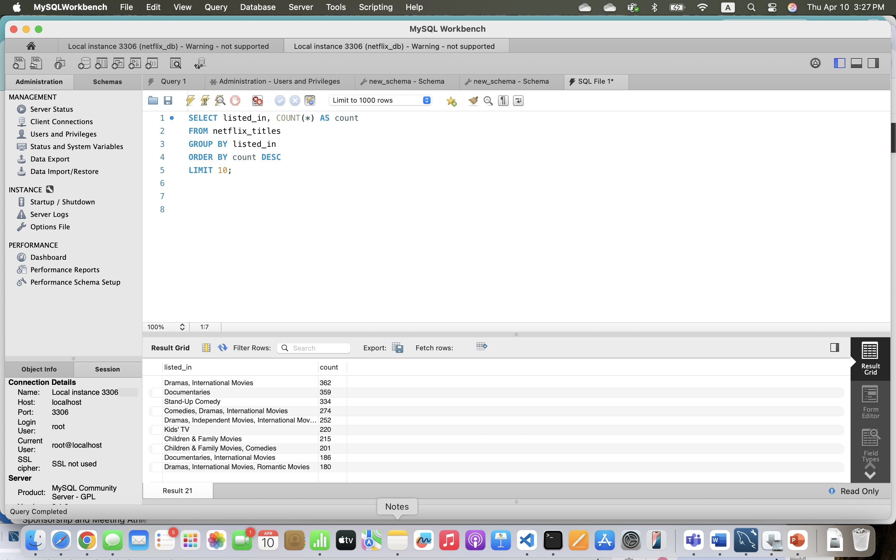
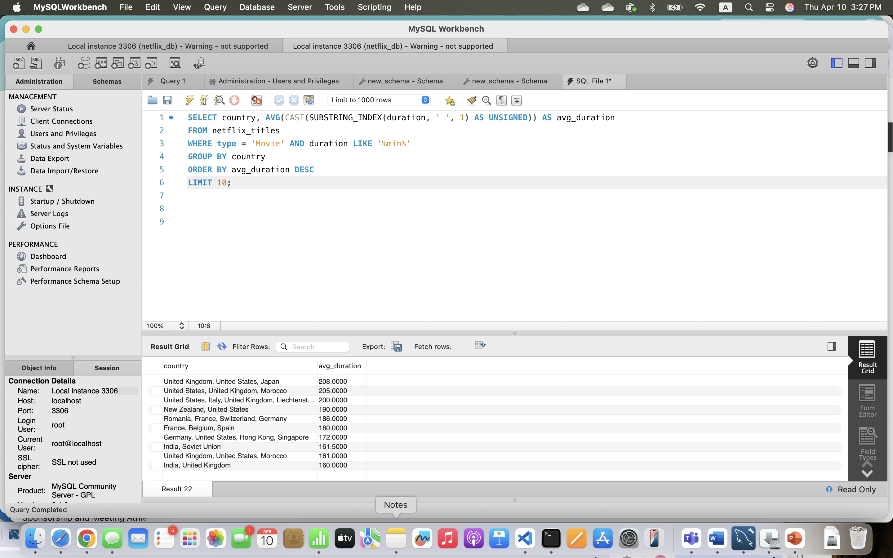
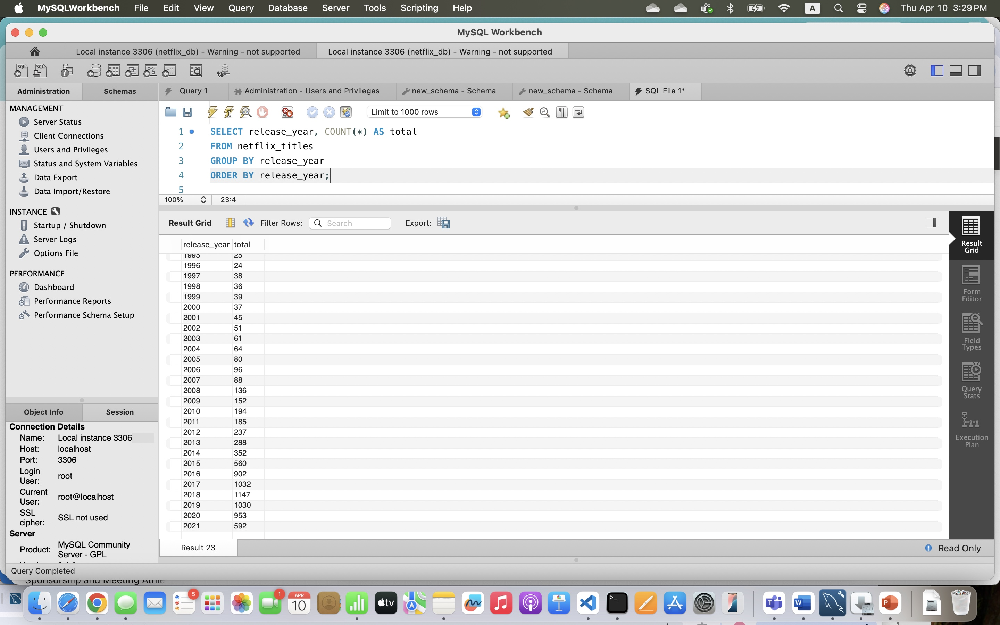
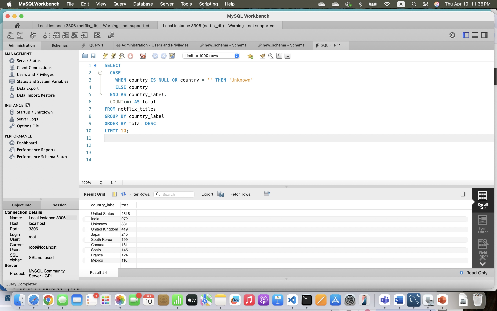

## Project Summary

This project explores Netflix content using  MySQL Workbench for querying and Python for data import.  
It provides insights into genre popularity, movie durations, release year trends, and top countries producing content.

## Tools Used

- MySQL Workbench (for SQL analysis)
- Python (to import CSV into MySQL)
- Git & GitHub (for version control and sharing)
- VS Code (as my development environment)

## Python Data Import

Python was used to:
- Load `netflix_titles.csv`
- Connect to MySQL with `mysql-connector-python`
- Insert data into the `netflix_titles` table

📂 [SQL.py](SQL.py)

## SQL Analysis via MySQL Workbench

Queries were run using MySQL Workbench, including:
- Top 10 most common genres
- Average movie duration by country
- Netflix release trends over time
- Top countries by content volume

📄 [queries.sql](queries.sql)

## 📸 This is SQL Results via MySQL Workbench

These screenshots show query results from MySQL Workbench.

### 🎭 Top 10 Genres
Shows which content categories appear most on Netflix.

### ⏱️ Average Movie Duration by Country
Highlights countries with the longest average movie runtime.

### 📆 Titles Released Per Year
Shows content growth and release trends by year.

### 🌍 Top 10 Countries by Content
Displays which countries contribute the most to Netflix's catalog.

Source: [Kaggle - Netflix Shows Dataset](https://www.kaggle.com/datasets/shivamb/netflix-shows)
